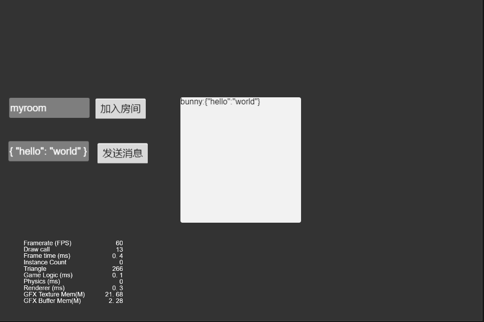

# nakama_client_demo
基于[nakama](https://github.com/heroiclabs/nakama)的cocos creator客户端演示demo

## 运行
1，安装nakama 
https://github.com/heroiclabs/nakama 
2,安装cocos creator3.4.2,打开本工程即可

## 介绍
nakama是用于社交和实时游戏和应用的分布式服务器框架，本项目搭建了个客户端，使用nakama提供的丰富的接口，实现从登录到游戏内部分功能

### 登录
 
nakama提供丰富的[登录鉴权](https://heroiclabs.com/docs/nakama/concepts/authentication) 
这里使用了authenticateEmail和authenticateDevice实现邮件登录和设备Id登录

### 大厅
 
登录验证通过后即进入了游戏大厅，大厅里列举了以下功能: 聊天，好友，游戏，点击按钮进入对应功能块

### 聊天
 
https://heroiclabs.com/docs/nakama/concepts/chat/

### 好友
 
https://heroiclabs.com/docs/nakama/concepts/friends/

### 游戏
  
https://heroiclabs.com/docs/nakama/concepts/multiplayer/

这里只有创建\加入游戏，发送游戏数据，默认的是Client Relayed Multiplayer(帧同步) 

可以创建状态Authoritative Multiplayer（状态同步）：
https://github.com/0990/nakama-go-demo

## TODO
* 功能丰富，比如组功能，排行榜功能
* 帧同步游戏完善，弄一个mini小游戏

